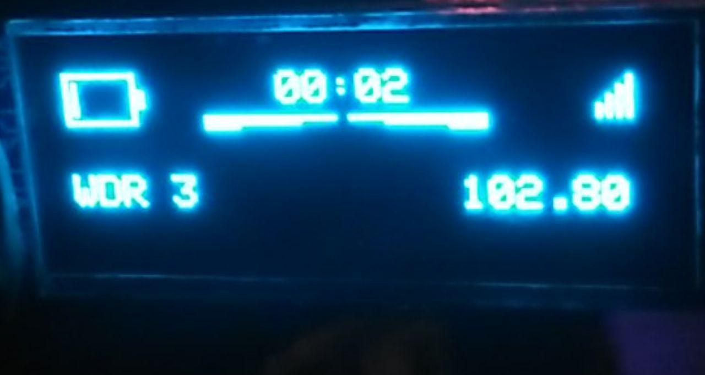
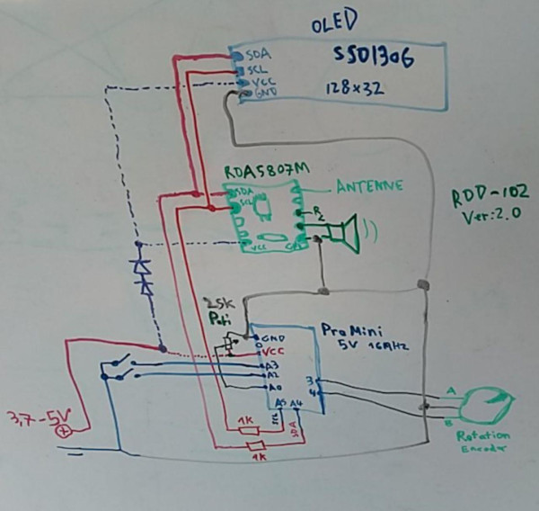
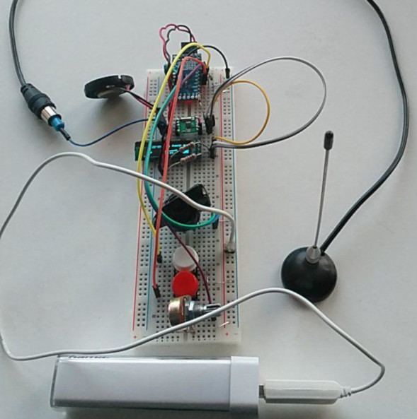
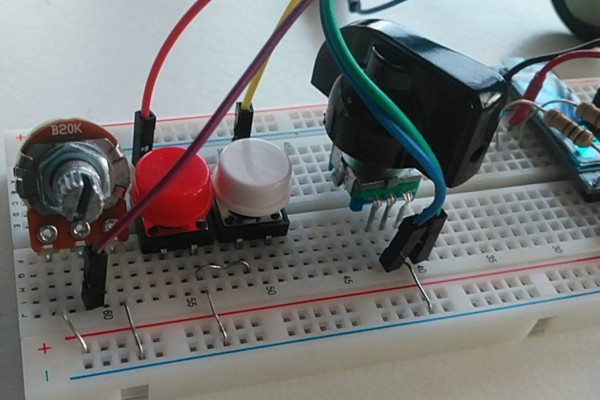
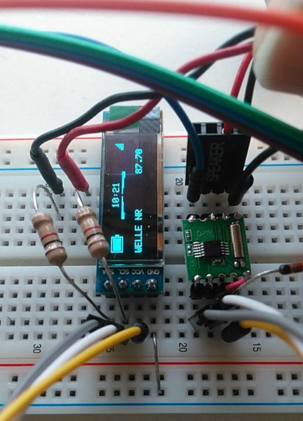
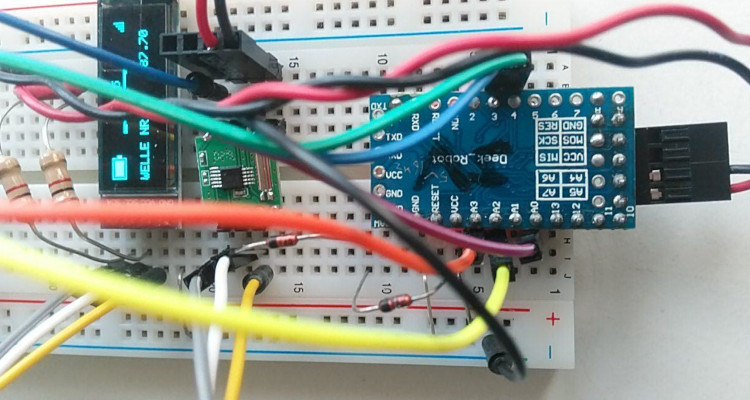

# i2c FMradio rdd102

- Arduino Pro Mini (5V, 16MHz is nice)
- RDA5807M Radio module (3.6V max), YOU NEED THE Radio LIB
- SSD1306 128x32 display (< 5V), YOU NEED GFX LIB
- 2 buttons (to ground) to browse through preset
- a 25k poti for digital volume control
- 1 rotation encoder for fine tuning
- 2 glass diodes
- 2x 1k resistor

Display: Powerbar, RDS time, signal strength, volume level, RDS station name, frequency

Hacking: Resistors to the i2c bus, because the radio dislike a 5V i2c bus system.

Hacking: The two diodes set voltage down ;o)

## Bugs

- RDS stuff (time) is still buggy (lib problem?)
- poti values (volume) and powerbar (voltage limits) may differ

## Missing Features

- store preset in eeprom
- music visualizer
